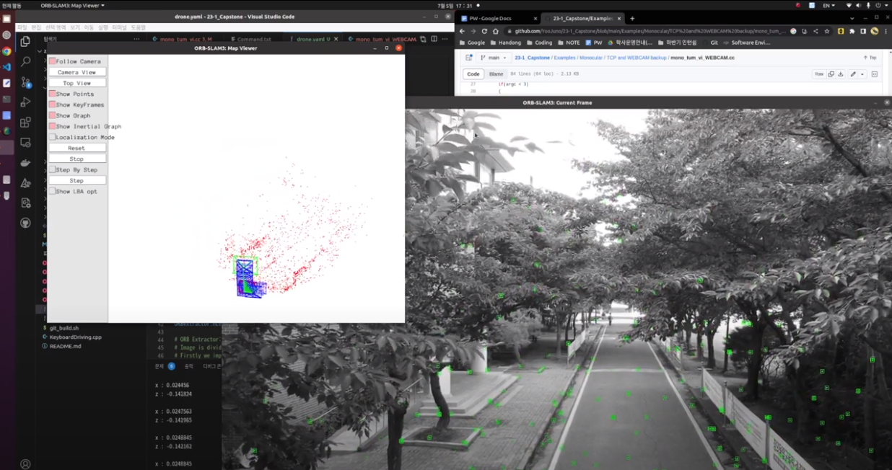
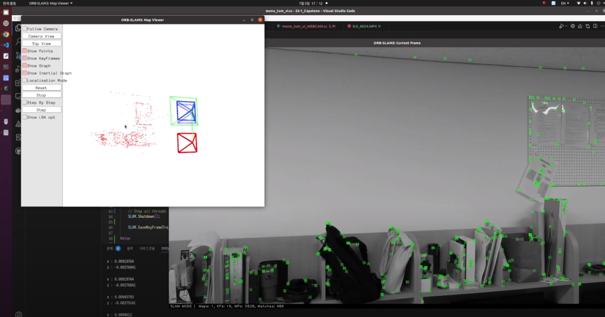

# Description

**[Referrence link]**

### [YouTube LINK](https://youtu.be/XvKIvkEmncU)

**[Model]**

DJI SPARK

**[Place]**
Hanondg Glabal University OH

**[Video Info]**
size - 1920 x 1080
fps - 30

**[Intrinsic Parameters]**
fx = 1850.068921
fy = 1850.068921
cx = 960.000000
cy = 540.000000
k1 = 0.091977
k2 = -0.295672
p1 = 0.001470
p2 = 0.004137

## **구현 환경**

* UBUNTU20.04
* C++
* OPENCV4.4.0
* BOOST LIBRARY
* Pangolin
